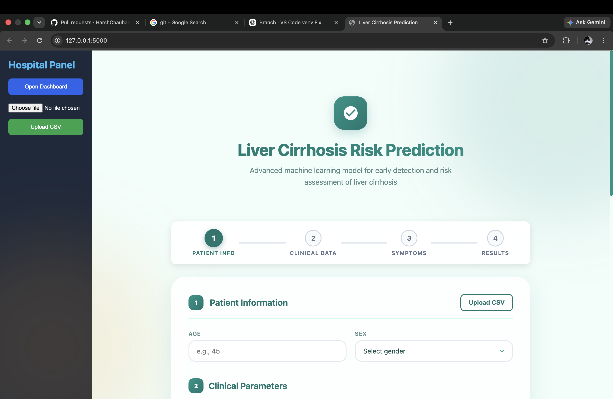
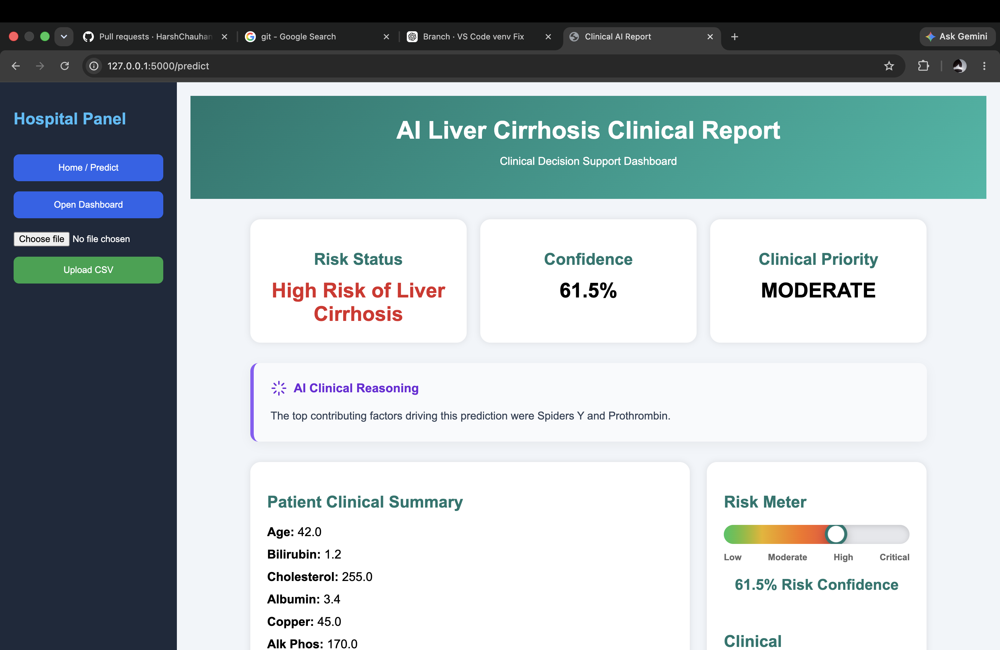
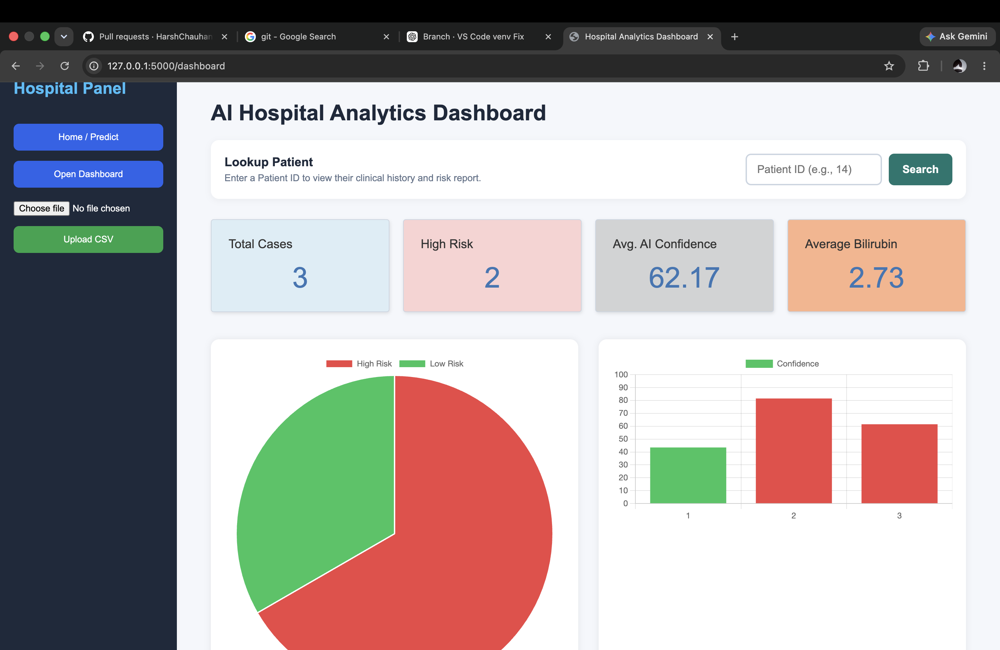
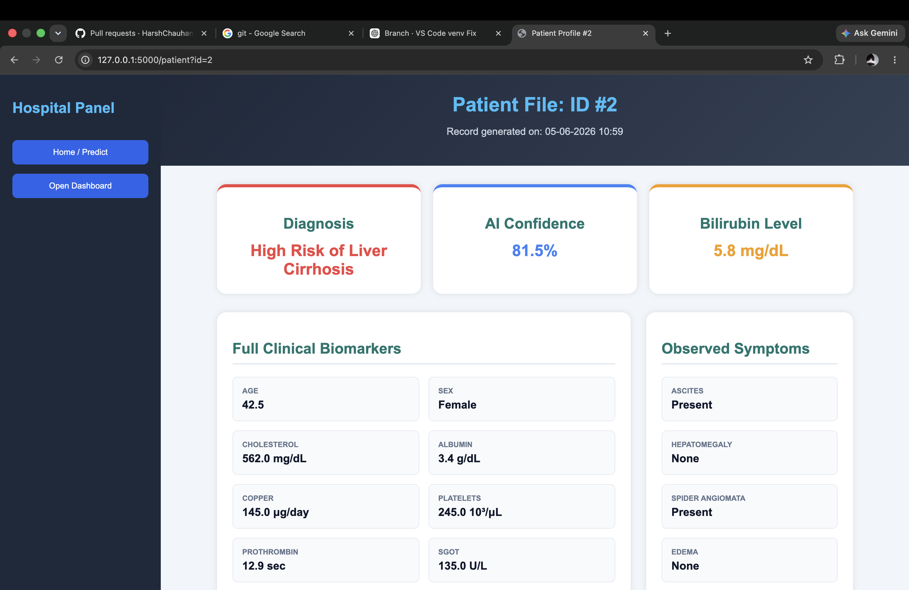

# AI-Based Liver Cirrhosis Risk Prediction and Analytics System
This project is an end-to-end Machine Learning web application that predicts the risk of liver cirrhosis using clinical patient data. The application integrates Machine Learning, Flask, SQLite, SQL, Tableau, and interactive dashboards for prediction, patient record management, and healthcare analytics.

## Features

- Predicts Liver Cirrhosis Risk using Machine Learning
- Interactive Flask Web Application
- Patient Record Management using SQLite
- Prediction History Dashboard
- Patient Profile Page
- Interactive Charts using Chart.js
- Healthcare Analytics Dashboard in Tableau
- SHAP Explainable AI for Model Interpretation

## Technology Stack

- Python
- Flask
- Scikit-Learn
- Pandas
- NumPy
- SQLite
- SQL
- HTML
- CSS
- JavaScript
- Chart.js
- Tableau

## Project Structure

```text
AI-Liver-Cirrhosis-Risk-Prediction
│
├── app/
├── data/
├── models/
├── notebooks/
├── scripts/
├── tableau/
├── screenshots/
├── requirements.txt
└── README.md
```

## Machine Learning Workflow

1. Data Collection
2. Data Cleaning
3. Exploratory Data Analysis
4. Feature Engineering
5. Data Balancing using SMOTE
6. Model Training
7. Model Evaluation
8. SHAP Explainability
9. Model Deployment using Flask
10. Dashboard Visualization


## Models Trained

- Logistic Regression
- Random Forest
- XGBoost


## Dataset

The project uses liver cirrhosis clinical datasets containing patient medical information such as:

- Age
- Bilirubin
- Albumin
- Cholesterol
- Copper
- SGOT
- Platelets
- Prothrombin
- Triglycerides


## Flask Application

The Flask application provides:

- Patient Prediction Form
- Prediction Result Page
- Dashboard
- Patient Profile
- SQLite Database Integration


## Tableau Dashboard

The Tableau dashboard provides healthcare analytics including:

- Risk Distribution
- Patient Statistics
- Age Analysis
- Bilirubin Analysis
- Disease Insights

## Screenshots

### Home Page



### Prediction Page



### Dashboard



### Patient Search




## Installation

Clone the repository

```bash
git clone https://github.com/HarshChauhanvats/AI-Liver-Cirrhosis-Risk-Prediction.git


## Author

Harsh Chauhan

B.Tech Computer Science Engineering

Machine Learning & Data Analytics Enthusiast
